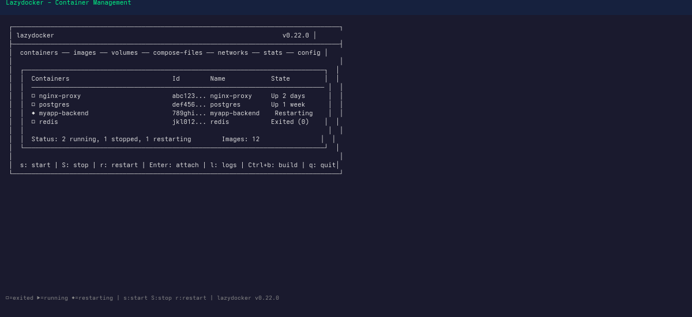
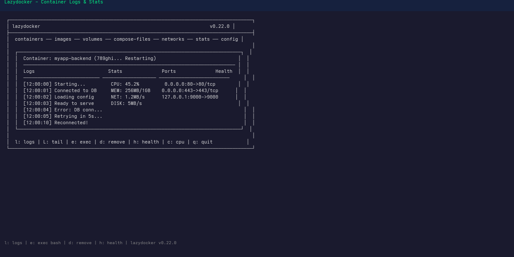

# Lazydocker - Terminal UI for Docker

A simple terminal UI for both Docker and Docker Compose, written in Go.

## What is Lazydocker?

Lazydocker provides a visual interface for managing Docker containers, images, volumes, and networks without leaving the terminal. It complements the Docker CLI with an intuitive TUI.

## Benefits

- **Visual overview**: See all containers, images, volumes at a glance
- **Container management**: Start, stop, restart, view logs, attach
- **Docker Compose**: Full compose file support
- **Stats & monitoring**: CPU, memory, network usage in real-time
- **Quick actions**: No need to remember complex CLI flags
- **Service health**: Visual indicators for container health

## Installation

```bash
# Arch Linux (AUR)
yay -S lazydocker

# macOS (Homebrew)
brew install lazydocker

# Nix
nix-env -iA nixpkgs.lazydocker

# Go
go install github.com/jesseduffield/lazydocker@latest

# Binary release
curl -Lo lazydocker.tar.gz https://github.com/jesseduffield/lazydocker/releases/latest/download/lazydocker_Linux_x86_64.tar.gz
tar -xzf lazydocker.tar.gz
sudo mv lazydocker /usr/local/bin/

# Docker (optional - run as container)
docker run --rm -it -v /var/run/docker.sock:/var/run/docker.sock \
  -v "$HOME/.config/jesseduffield:/config" \
  jesseduffield/lazydocker
```

## Main Interface



```
┌──────────────────────────────────────────────────────────────────────────────────────┐
│ lazydocker                                                            v0.22.0 │
├──────────────────────────────────────────────────────────────────────────────────────┤
│  containers ── images ── volumes ── compose-files ── networks ── stats ── config │
│                                                                                      │
│  ┌───────────────────────────────────────────────────────────────────────────────┐  │
│  │  Containers                           Id        Name            State         │  │
│  │  ───────────────────────────────────────────────────────────────────────────── │  │
│  │  □ nginx-proxy                        abc123... nginx-proxy     Up 2 days      │  │
│  │  □ postgres                           def456... postgres        Up 1 week      │  │
│  │  ◆ myapp-backend                      789ghi... myapp-backend    Restarting    │  │
│  │  □ redis                              jkl012... redis           Exited (0)    │  │
│  │                                                                                │  │
│  │  Status: 2 running, 1 stopped, 1 restarting        Images: 12                │  │
│  │                                                                                │  │
│  └───────────────────────────────────────────────────────────────────────────────┘  │
│                                                                                      │
│  ┌───────────────────────────────────────────────────────────────────────────────┐  │
│  │  Container: myapp-backend (789ghi...)                                        │  │
│  │  ─────────────────────────────────────────────────────────────────────────── │  │
│  │  Logs                          Stats                                         │  │
│  │  ───────────────────────────── ─────────────────────────────                 │  │
│  │  [12:00:00] Starting...                                                     │  │
│  │  [12:00:01] Connected to database                                           │  │
│  │  [12:00:02] Error: connection refused                                      │  │
│  │                                                                              │  │
│  └───────────────────────────────────────────────────────────────────────────────┘  │
│                                                                                      │
│  ────────────────────────────────────────────────────────────────────────────────   │
│  s: start | S: stop | r: restart | Enter: attach | l: logs | Ctrl+b: build | q: quit│
│  ────────────────────────────────────────────────────────────────────────────────   │
└──────────────────────────────────────────────────────────────────────────────────────┘
```

## Keybindings

### Global Navigation

| Key | Action |
|-----|--------|
| `Tab` | Switch between panels |
| `Ctrl+R` | Refresh |
| `Ctrl+C` | Quit |
| `Ctrl+P` | Previous panel |
| `Ctrl+N` | Next panel |
| `Esc` | Go back / Cancel |
| `/` | Filter (search) |
| `↑/↓` | Navigate |
| `←/→` | Expand/collapse section |
| `PgUp/PgDn` | Scroll |

### Containers Panel

| Key | Action |
|-----|--------|
| `Enter` | Attach to container |
| `Space` | Select container |
| `s` | Start |
| `S` | Stop |
| `r` | Restart |
| `d` | Remove (with confirmation) |
| `l` | View logs |
| `L` | Toggle auto-refresh logs |
| `Ctrl+B` | Build image |
| `Ctrl+R` | Rename |
| `e` | Exec command |
| `h` | View health check |

### Images Panel

| Key | Action |
|-----|--------|
| `Enter` | View image details |
| `d` | Remove image |
| `Ctrl+B` | Build from Dockerfile |
| `Ctrl+I` | Import image |
| `P` | Push to registry |
| `pull` | Pull image |

### Volumes Panel

| Key | Action |
|-----|--------|
| `Enter` | View volume details |
| `d` | Remove volume |

### Compose Panel

| Key | Action |
|-----|--------|
| `Enter` | View compose file |
| `u` | Compose up |
| `U` | Compose down |
| `r` | Compose restart |
| `Ctrl+R` | Refresh |

### Networks Panel

| Key | Action |
|-----|--------|
| `Enter` | View network details |
| `d` | Remove network |

### Stats Panel

| Key | Action |
|-----|--------|
| `Space` | Pause/Unpause updates |
| `c` | Toggle CPU percentage |
| `m` | Toggle memory percentage |
| `i` | Toggle I/O |

## Main View Areas

```
┌─────────────────────────────────────────────────────────────────┐
│  Containers  │  Selected Container Details                     │
│  ────────────┼──────────────────────────────────────────────────│
│               │  [Logs]  [Stats]  [Env]  [Ports]  [Health]     │
├───────────────┼──────────────────────────────────────────────────┤
│  Images       │  Main Content Area (logs, stats, etc.)         │
├───────────────┼──────────────────────────────────────────────────┤
│  Volumes      │                                                 │
├───────────────┼──────────────────────────────────────────────────┤
│  Compose      │                                                 │
├───────────────┼──────────────────────────────────────────────────┤
│  Networks     │                                                 │
└───────────────┴─────────────────────────────────────────────────┘
```

## Common Workflows

### View Container Logs

```
1. Containers panel: Select container
2. l: Open logs view
3. ↑/↓: Scroll through logs
4. Ctrl+C: Close logs
```

### Monitor Container Stats

```
1. Stats panel (navigate to it)
2. ↑/↓: Select container
3. Space: Pause updates
4. c/m/i: Toggle CPU/Memory/IO display
```

### Start/Stop Container

```
1. Containers panel: Select container
2. s: Start (or S to stop)
3. Panel refreshes with new status
```

### Restart Stuck Container

```
1. Containers panel: Select container (shows "Restarting")
2. r: Restart
3. Wait for healthy status
```

### Docker Compose Up/Down

```
1. Compose panel
2. Select compose project
3. u: Compose up (with rebuilding)
4. U: Compose down
```

### Remove Unused Images

```
1. Images panel
2. Navigate to <none> images
3. d: Remove each (with confirmation)
```

### Clean Up Everything



```
1. Press 'x' for main menu
2. Select "Prune containers"
3. Select "Prune images"
4. Select "Prune volumes"
```

### View Container Health

```
1. Containers panel: Select container
2. h: View health check status
3. Shows: healthy, starting, unhealthy
```

### Execute Command in Container

```
1. Containers panel: Select container
2. e: Exec command
3. Enter command (e.g., /bin/bash)
4. Exit: Ctrl+C twice
```

### Attach to Running Container

```
1. Containers panel: Select container
2. Enter: Attach to container
3. Exit: Ctrl+C (detaches)
```

## Container States Visual Guide

| Symbol | State | Description |
|--------|-------|-------------|
| `□` | Exited | Container stopped |
| `▶` | Running | Container is running |
| `◆` | Restarting | Container in crash loop |
| `◉` | Paused | Container paused |
| `○` | Created | Created but not started |

## Configuration

### Config File (`~/.config/jesseduffield/lazydocker/`)

```yaml
gui:
  height: 0.5
  width: 0.5
  theme:
    activeBorderColor:
      - green
      - bold
    inactiveBorderColor:
      - white
  returnAfterExit: true
  showAllContainers: true

command:
  dockerComposeCommand: "docker-compose"

customCommands:
  - name: "Bash"
    attach: true
    command: "exec {{.Container.Name}} /bin/bash"
    context: "containers"
```

### Environment Variables

```bash
# Custom Docker socket
export DOCKER_SOCKET="/path/to/docker.sock"

# Docker host
export DOCKER_HOST="tcp://localhost:2375"
```

## Integration with Docker-Concepts

This section connects lazydocker usage to concepts covered in other modules:

| Concept | Module | Lazydocker Equivalent |
|---------|--------|----------------------|
| Containers | [[03-Containers]] | Containers panel, s/S/r/Enter |
| Images | [[02-Images]] | Images panel, d/Pull |
| Networking | [[04-Networking]] | Networks panel, Ports tab |
| Volumes | [[05-Volumes]] | Volumes panel |
| Docker Compose | [[06-Docker-Compose]] | Compose panel (u/U) |
| Containerization | [[08-Containerization]] | Health checks, Stats monitoring |

### Practice Workflows

1. **After [[02-Images]]**: Browse images, see layers and sizes
2. **After [[03-Containers]]**: Start, stop, attach to containers visually
3. **After [[04-Networking]]**: View port mappings in container details
4. **After [[05-Volumes]]**: Inspect volume mounts and data
5. **After [[06-Docker-Compose]]**: Manage multi-container apps with compose panel
6. **After [[08-Containerization]]**: Monitor health and stats for running containers

### Managing Development Environment

```bash
# Typical workflow for development
1. lazydocker
2. Compose panel: u (up) - rebuilds and starts
3. Containers panel: Watch logs (l) during development
4. Make code changes
5. Compose panel: u (up) - rebuilds automatically
6. Check container stats for performance
```

## Tips & Tricks

- **Bulk actions**: Select multiple containers with Space
- **Auto-refresh**: Set `refreshInterval` in config
- **Color coding**: Green = running, Red = stopped
- **Quick filters**: `/` to filter containers by name
- **Persistent logs**: `L` toggles continuous log following
- **Copy container ID**: `y` copies selected container ID
- **One-line status**: Bottom bar shows summary counts

## Troubleshooting

| Issue | Solution |
|-------|----------|
| Cannot connect to Docker | Check `DOCKER_SOCKET` permissions |
| Missing containers | Toggle "show all" (config: showAllContainers) |
| Slow UI | Reduce `refreshInterval` |
| Logs not showing | Press `l` in containers panel |
| Colors wrong | Set `TERM=xterm-256color` |

## Related

- [[02-Images]] - Docker Images
- [[03-Containers]] - Managing Containers
- [[04-Networking]] - Docker Networking
- [[05-Volumes]] - Data Persistence
- [[06-Docker-Compose]] - Multi-container Apps
- [[08-Containerization]] - Best Practices
- [[09-Cheatsheet]] - Docker Commands

## External Resources

- [Lazydocker GitHub](https://github.com/jesseduffield/lazydocker)
- [Lazydocker Documentation](https://docs.lazydocker.org/)
- [Lazydocker Wiki](https://github.com/jesseduffield/lazydocker/wiki)
- [Installation Guide](https://github.com/jesseduffield/lazydocker#installation)

## Next Steps

Return to [[index]] for full Docker concepts overview, or continue to [[09-Cheatsheet]] for command reference.
