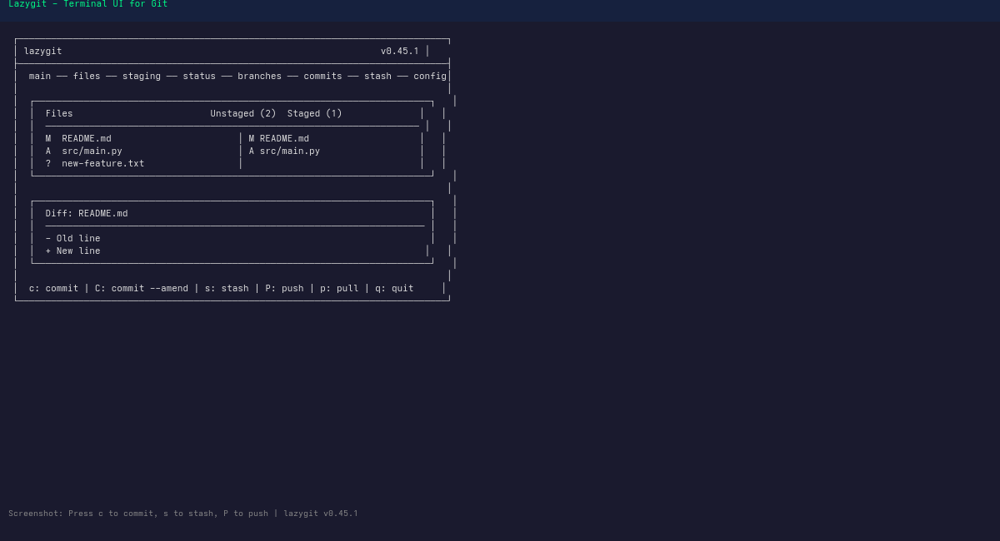
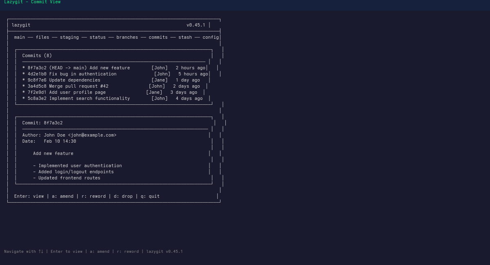

# Lazygit - Terminal UI for Git

A simple terminal UI for git commands, written in Go with the gocui library.

## What is Lazygit?

Lazygit provides an intuitive interface for common Git operations without leaving the terminal. It combines the power of Git with the usability of a TUI (Text User Interface).

## Benefits

- **Visual diff**: See changes without memorizing flags
- **Stage line-by-line**: Granular control over what goes into commits
- **Conflict resolution**: Visual merge conflict handling
- **Branching**: Easy branch switching and management
- **Speed**: Keyboard-driven, no context switching to GUI

## Installation

```bash
# Arch Linux (AUR)
yay -S lazygit

# macOS (Homebrew)
brew install lazygit

# Nix
nix-env -iA nixpkgs.lazygit

# Go
go install github.com/jesseduffield/lazygit@latest

# Binary release
curl -Lo lazygit.tar.gz https://github.com/jesseduffield/lazygit/releases/latest/download/lazygit_Linux_x86_64.tar.gz
tar -xzf lazygit.tar.gz
sudo mv lazygit /usr/local/bin/
```

## Main Interface



```
┌──────────────────────────────────────────────────────────────────────────────┐
│ lazygit                                                          v0.45.1 │
├──────────────────────────────────────────────────────────────────────────────┤
│                                                                              │
│  main ── files ── staging ── status ── branches ── commits ── stash ── config│
│                                                                              │
│  ┌────────────────────────────────────────────────────────────────────────┐   │
│  │  Files                         Unstaged (2)  Staged (1)              │   │
│  │  ──────────────────────────────────────────────────────────────────── │   │
│  │  M  README.md                       │ M README.md                    │   │
│  │  A  src/main.py                     │ A src/main.py                  │   │
│  │  ?  new-feature.txt                 │                                │   │
│  │                                      │                                │   │
│  │                                      │                                │   │
│  │                                      │                                │   │
│  └────────────────────────────────────────────────────────────────────────┘   │
│                                                                              │
│  ┌────────────────────────────────────────────────────────────────────────┐   │
│  │  Diff: README.md                                                       │   │
│  │  ───────────────────────────────────────────────────────────────────── │   │
│  │  - Old line                                                            │   │
│  │  + New line                                                           │   │
│  │                                                                          │   │
│  └────────────────────────────────────────────────────────────────────────┘   │
│                                                                              │
│  ─────────────────────────────────────────────────────────────────────────── │
│  c: commit | C: commit --amend | s: stash | P: push | p: pull | q: quit     │
│  ─────────────────────────────────────────────────────────────────────────── │
└──────────────────────────────────────────────────────────────────────────────┘
```

## Keybindings

### Global Navigation

| Key | Action |
|-----|--------|
| `Tab` | Switch between panels |
| `Ctrl+R` | Refresh |
| `Ctrl+C` | Quit |
| `Ctrl+P` | Previous view |
| `Ctrl+N` | Next view |
| `Esc` | Go back / Cancel |
| `/` | Filter (search) |
| `↑/↓` | Navigate |
| `←/→` | Expand/collapse |

### Files Panel

| Key | Action |
|-----|--------|
| `Space` | Stage/unstage file |
| `Enter` | View diff |
| `A` | Stage all changes |
| `Ctrl+A` | Stage all changes |
| `Ctrl+U` | Unstage all |
| `D` | Discard changes (with confirmation) |
| `M` | View merge conflicts |
| `O` | Open in editor |

### Staging Panel

| Key | Action |
|-----|--------|
| `Space` | Stage line / selection |
| `V` | Toggle visual selection mode |
| `Ctrl+A` | Stage all |
| `Ctrl+U` | Unstage all |
| `E` | Edit file in editor |

### Commits Panel

| Key | Action |
|-----|--------|
| `Enter` | View commit details |
| `Space` | Revert commit |
| `A` | Amend with staged |
| `r` | Reword commit |
| `R` | Rename commit message |
| `d` | Drop commit |
| `f` | Fixup commit |
| `s` | Squash with previous |
| `Ctrl+B` | Create branch at commit |

### Branches Panel

| Key | Action |
|-----|--------|
| `Enter` | Checkout branch |
| `Space` | Checkout commit as branch |
| `c` | Create new branch |
| `M` | Merge branch |
| `R` | Rename branch |
| `D` | Delete branch |

### Stash Panel

| Key | Action |
|-----|--------|
| `Space` | Apply stash |
| `Enter` | View stash diff |
| `d` | Drop stash |
| `Ctrl+P` | Pop stash |

### Main View Areas

```
┌─────────────────────────────────────────┐
│  Files    │  Staged Changes             │
│  ─────────┼────────────────────────────│
│            │  Unstaged Changes          │
├────────────┼────────────────────────────┤
│  Submodules│  Main Diff View             │
└────────────┴────────────────────────────┘
```

## Common Workflows

### Quick Commit

```
1. Files panel: Select changed file(s)
2. Space: Stage file(s)
3. c: Open commit message
4. Type message
5. Enter: Confirm commit
6. P: Push to remote
```

### Amend Last Commit

```
1. Stage new changes (Space on files)
2. A: Amend with staged
3. Update message if needed
4. Enter: Save
```

### Create Feature Branch

```
1. Branches panel
2. c: Create branch
3. Enter branch name (e.g., feature/new-login)
4. Enter: Create
5. Files panel: Make changes
6. Stage, commit
```

### View Commit History

```
1. Commits panel (navigate to it)
2. ↑/↓: Scroll through commits
3. Enter: View detailed diff
4. Esc: Go back
```

### Resolve Merge Conflicts

```
1. Files panel shows conflicts (marked with 'UU' or 'AA')
2. M: View merge conflicts
3. Navigate to conflict
4. Choose: us (ours), th (theirs), b (both), o (open in editor)
5. Space: Stage resolved file
6. Commit merge
```

### Interactive Rebase

```
1. Commits panel
2. Select commit to rebase from
3. Ctrl+B: Interactive rebase
4. Navigate commits
5. r: Reword, d: Drop, s: Squash
6. Ctrl+R: Start rebase
```

### Undo Mistakes

```
1. Ctrl+Z: Undo last action
2. Multiple Ctrl+Z: Undo multiple
3. Ctrl+Y: Redo
```

### Search/Filter

```
1. /: Open filter
2. Type search term
3. Enter: Apply filter
4. Ctrl+C: Clear filter
```

## Configuration

### Keybindings File (`~/.config/jesseduffield/lazygit/`)

```yaml
# ~/.config/jesseduffield/lazygit/config.yml

gui:
  authorColors:
    "john.doe@example.com": "cyan"
  dateFormat: "2006-01-02 15:04"
  theme:
    activeBorderColor:
      - green
      - bold
    inactiveBorderColor:
      - white
  scrollHeight: 2
  sidePanelWidth: 0.25

keybinding:
  files:
    toggleStagedAll: "C-a"
    refreshFiles: "C-r"
  commits:
    copyCommitMessage: "C-y"
```

### Environment Variables

```bash
# Use custom editor
export EDITOR="nvim"
export GIT_EDITOR="nvim"

# Pager settings
export GIT_PAGER="delta"
```

### Custom Commands

```yaml
customCommands:
  - key: "E"
    command: "echo {{.SelectedFile.Name}}"
    context: "files"
    description: "Echo selected filename"
```

## Integration with Git-Concepts

This section connects lazygit usage to concepts covered in other modules:

| Concept | Module | Lazygit Equivalent |
|---------|--------|-------------------|
| Basic workflow | [[05-Basic-Workflow]] | Files → Space → c → commit |
| Inspection | [[06-Inspection]] | Commits panel, Enter on commit |
| Undo/Fix | [[07-Undo-Fix]] | Ctrl+Z undo, A amend |
| Branching | [[08-Branching]] | Branches panel (c, M, D) |
| Rebase | [[09-Rebase]] | Ctrl+B interactive rebase |
| Stashing | [[11-Stashing]] | Stash panel |
| Remotes | [[12-Remotes]] | P push, p pull |
| Tags | [[13-Tags]] | Tags panel (custom config) |

### Practice Workflows



1. **After [[05-Basic-Workflow]]**: Practice staging files and committing in lazygit
2. **After [[06-Inspection]]**: Use commits panel to browse history visually
3. **After [[07-Undo-Fix]]**: Use undo (Ctrl+Z) and amend (A) features
4. **After [[08-Branching]]**: Create and switch branches visually
5. **After [[09-Rebase]]**: Try interactive rebase with Ctrl+B

## Tips & Tricks

- **Bulk staging**: `Ctrl+A` stages all, `Ctrl+U` unstages all
- **Quick push**: `P` with default remote/branch
- **Pull + rebase**: Set `pull.mode = rebase` in config
- **Diff highlighting**: Uses delta if installed
- **Mouse support**: Enable with `mouse: true` in config
- **Custom panels**: Add commits/stash/branches to main view
- **Copy commit hash**: `y` in commits panel

## Troubleshooting

| Issue | Solution |
|-------|----------|
| Colors not showing | Set `TERM=xterm-256color` |
| Slow with large repos | Disable telemetry, reduce refresh rate |
| Keybinding conflicts | Check terminal emulator shortcuts |
| Editor not opening | Set `EDITOR` and `GIT_EDITOR` env vars |

## Related

- [[05-Basic-Workflow]] - Git basic workflow
- [[06-Inspection]] - Inspecting repository state
- [[07-Undo-Fix]] - Undoing changes
- [[08-Branching]] - Branching operations
- [[09-Rebase]] - Rebase operations

## External Resources

- [Lazygit GitHub](https://github.com/jesseduffield/lazygit)
- [Lazygit Documentation](https://lazygit.org/docs/)
- [Lazygit Wiki](https://github.com/jesseduffield/lazygit/wiki)
- [Installation Guide](https://github.com/jesseduffield/lazygit#installation)

## Next Steps

Proceed to [[Git-GitHub-Workflow/index]] for GitHub-specific workflows, or return to the [[index]] for full overview.
